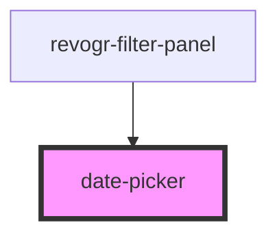

# date-picker

<!-- Auto Generated Below -->

## Properties

| Property      | Attribute      | Description | Type     | Default     |
| ------------- | -------------- | ----------- | -------- | ----------- |
| `input_class` | `input_class`  |             | `string` | `undefined` |
| `input_id`    | `input_id`     |             | `string` | `undefined` |
| `placeHolder` | `place-holder` |             | `string` | `''`        |
| `type`        | `type`         |             | `string` | `undefined` |

## Dependencies

### Used by

 - [revogr-filter-panel](..)

### Graph

----------------------------------------------

*Built with [StencilJS](https://stenciljs.com/)*
