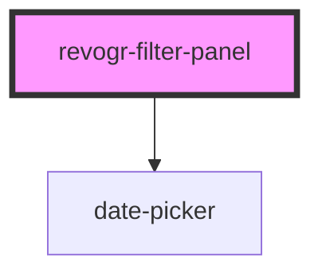

# revogr-filter-panel

<!-- Auto Generated Below -->

## Properties

| Property                  | Attribute                   | Description | Type                                                              | Default     |
| ------------------------- | --------------------------- | ----------- | ----------------------------------------------------------------- | ----------- |
| `disableDynamicFiltering` | `disable-dynamic-filtering` |             | `boolean`                                                         | `false`     |
| `filterCaptions`          | --                          |             | `{ title: string; save: string; reset: string; cancel: string; }` | `undefined` |
| `filterEntities`          | --                          |             | `{ [x: string]: LogicFunction; }`                                 | `{}`        |
| `filterItems`             | --                          |             | `{ [prop: string]: FilterData[]; }`                               | `{}`        |
| `filterNames`             | --                          |             | `{ [x: string]: string; }`                                        | `{}`        |
| `filterTypes`             | --                          |             | `{ [x: string]: string[]; }`                                      | `{}`        |
| `uuid`                    | `uuid`                      |             | `string`                                                          | `undefined` |

## Events

| Event          | Description | Type                                             |
| -------------- | ----------- | ------------------------------------------------ |
| `filterChange` |             | `CustomEvent<{ [prop: string]: FilterData[]; }>` |

## Methods

### `getChanges() => Promise<ShowData>`

#### Returns

Type: `Promise<ShowData>`

### `show(newEntity?: ShowData) => Promise<void>`

#### Returns

Type: `Promise<void>`

## Dependencies

### Depends on

- [date-picker](plugins)

### Graph

----------------------------------------------

*Built with [StencilJS](https://stenciljs.com/)*
